# 👓Invoices AI Reader


## 📹 Video Demo
You can watch a video here: [Invoices AI Reader](https://youtu.be/3Bo6LmulKzw)
## 🧾 Description:

**Invoices AI Reader** reads invoices files in pdf format, extracting the relevant information of the document for accounting purposes as:
- Invoice number
- Date of issue
- Issuer name
- Client name
- Issuer Tax Id
- Taxable base ($)
- Tax rate (%)
- VAT/Sales Tax ($)
- Invoice Total ($)
- Currency

It then saves that information in a JSON formatted file.

It uses the Google Gemini API to parse the documents.
<br><br>

## 🧩 How this project solves real life problems
This project can be expanded to improve the productivity of any Finance & Administration department.

Being able to parse pdf invoices, extracting the key data needed in the F&A operations and saving it as JSON or in any other structured data required format could be a great application of AI in this environments.

The structured data extraction, facilitates the persistence of the extracted data in more sofisticated ways like using relational databases.

The project can also be integrated in the process flow of any accounting software, saving many hours of low value administrative tasks increasing the number of documents processed by unit of time, avoiding the need of the user to type manually the data.

Other use cases with the necessary tweaks could include automatic archiving and label extraction for document management applications, automatic conciliations with payment documents, etc.
<br><br>

## 🔀 Flowchart




*Diagram made with mermaid.ai*
<br><br>

## 📁 Project Structure
```
invoices/                   Main project folder.
├── project.py              REQUIRED: contains main() and 3+ custom functions.
├── test_project.py         REQUIRED: contains pytest test functions.
├── requirements.txt        REQUIRED: pip-installable libraries.
├── README.md               REQUIRED: contains project title, youtube demo video │                                     url and description of the project.
├── invoices/               Folder for sample PDF invoices.
│   ├── sample1.pdf
│   ├── sample2.pdf
│   └── ...
└── data/                   Folder where the program saves extracted data in
    ├── sample1.json        JSON format.
    ├── sample2.json
    └── ...
```
<br><br>
## 💻How to install
Clone the repository
```
git clone https://github.com/javiersanser/invoices-ai-reader.git
```
Change the working directory
```
cd invoices-ai-reader
```
Create a virtual environment and activate it (recommended):

Windows
```
python -m venv venv
.\venv\Scripts\activate
```
Linux
```
python3 -m venv venv
source venv/bin/activate
```
Install dependencies
```
pip install -r requirements.txt
```
⚠ ⚠ ⚠
<br>
Now you have the code in your local machine, but beware...
You need to get a GEMINI AI STUDIO API KEY and set it up in the .env file in your local machine.

👉 Follow this instructions for doing that:
https://ai.google.dev/gemini-api/docs/api-key

For security reasons this file is not provided, instead you could use the provided ```.env.example``` file to know how to set the required environment variable with your API KEY, remember to add the file to your ```.gitignore``` file to avoid exposing it to the public.

```
GEMINI_API_KEY = YOUR API KEY
```

## ▶ How to launch and use the program

Once you had setup the API KEY in your ```.env``` file, save the file in the root directory of the program.

Run this command in the terminal:

```
python3 project.py
```
In some systems it could be:
```
python project.py
```

Remember to be inside the root folder, you must see ``` project.py ``` file if you run the ```ls``` command.

```
invoices-ai-reader/ $ ls
data/  invoices/  project.py  README.md  requirements.txt  test_project.py
```

Put the pdfs files of the invoices you want to extract the data from, in the ```invoices/``` folder.

You could get some invoices files examples in the repo referenced in the [📚References to documentation section](#-references-to-documentation-of-interest) of this same README.md


When you run the program you will see printed the main menu in the terminal:

```
------------------------------------------------------------
INVOICES AI READER - MAIN MENU
------------------------------------------------------------
1 - Show a list of unprocessed invoices files
2 - Show a list of processed json files
3 - Type the file name to process
4 - Process in bulk the unprocessed invoices
5 - Exit the program (you could also press Ctrl + C)
------------------------------------------------------------
Type the desired option (1,2,3,4,5) and press Enter:
```

Select the desired option 1-5 and press Enter.

Once you have run with success option (3) for processing a single file (remember that it is case sensitive) or (4) for processing all the unprocessed files in bulk, you could inspect the ```data``` folder to see the data extracted by the Gemini AI Model, you will see a ```invoice-file-name.json``` file with the data of the corresponding ```invoice-file-name.pdf``` file.

Expected output example of ```data/sample-invoice.json```:
```json
{"invoiceId": "1354",
"invoiceDate": "2026-08-04",
"issuerName": "NotZero Inc.",
"clientName": "Imaginary Enterprises Corp.",
"issuerTaxId": "null",
"taxableBase": 7200.0,
"taxRate": 21.0,
"taxAmount": 1512.0,
"invoiceTotal": 8712.0,
"invoiceCurrency": "USD"}
```

## 👨‍🎓 How this project has expanded my skills
- Researched about how to do a great README.md file
- Learned to use mermaid syntax to show diagrams in github, its history and the mermaid.ai site.
- Learned how to put badges on a github project and the shields.io site.
- Researched and implemented my first API Google AI use case for a real life problem solving project.
- Researched about JSON formatting in python and JSON schema in json-schema.org.
- Learned about how to adecuately prompt the AI model to obtain the desired structured data output in JSON schema.
- Learned about Google AI Studio and GEN AI SDK.
<br><br>


## 📚 References to documentation of interest

python-dotenv
https://pypi.org/project/python-dotenv/

google-genai
https://ai.google.dev/gemini-api/docs/libraries?hl=es-419

google-genai| python SDK
https://googleapis.github.io/python-genai/

Working with files
https://googleapis.github.io/python-genai/#with-uploaded-file-gemini-developer-api-only

Structured output
https://ai.google.dev/gemini-api/docs/structured-output?hl=es-419&example=recipe

JSON schema
https://json-schema.org/learn

Google GEN AI SDK reference using json schema
https://googleapis.github.io/python-genai/#json-response-schema

Invoices sample dataset source
https://github.com/parsee-ai/parsee-datasets/tree/main/datasets/invoices/raw_data

<br><br>

## ✅ SOME ISSUES AND DECISIONS
[🔴-Pending, 🟡-Work in progress, 🟢-Finished, 🟤- Discarded]
<br><br>

- 🔴 Considered if could be a good idea to prompt the user for AI model election, as models keep changing having it hardcoded could be a future issue as a deprecated hardcoded model will return an error in the API call functions. Could be better to list the available models and choose one or at least, check if the model is in the list. On the other side, non-technichal users could be unaware of the best models and its characteristics so asking for it could also not be free of potential issues.
- 🔴 Testing AI Models could be tricky, I've not mocked data for simplicity, but writing tests given that AI models responses are not deterministic but probabilistic could drive to some randomness in the testing.


## 💌 Possible Improvements (Roadmap)
- Detect automatically when new files are added in the directory, and run some kind of event driven process to extract the data.
- Make an automatic classification of processed files.
- Generate a more friendly GUI.
- Use a database for persistence in configuration options, API Keys, etc.
- Set the AI model as a configuration option.
- Automatic file renaming following a convention, avoiding name hell in the files.
- Put a human in the loop validation of the extracted data given the probabilistic nature of AI models responses.


